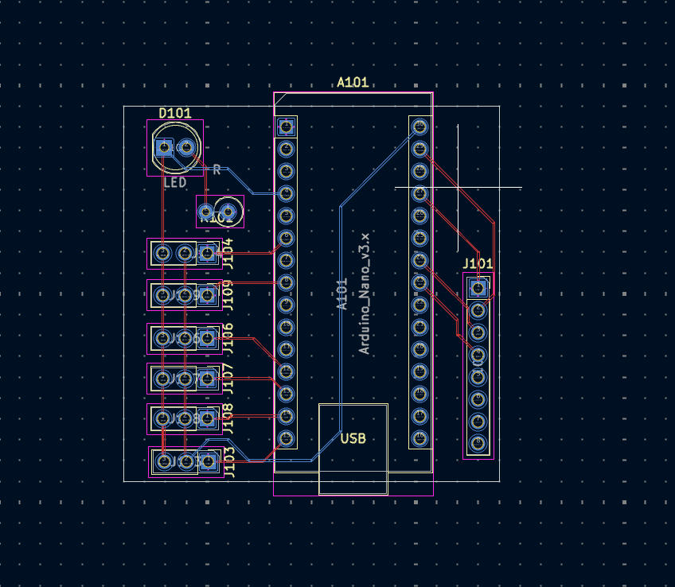
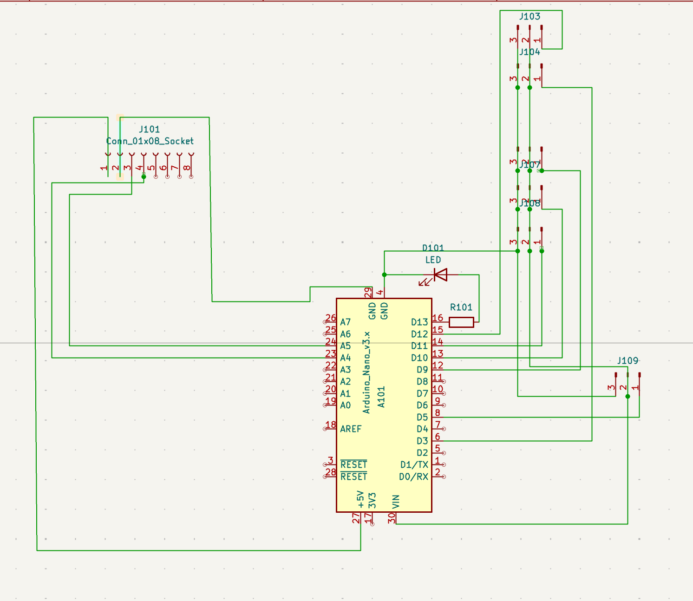

Arduflight
a arduino based rc plane flight controller

This is my custom flight controller built for planes
the main idea be behind this fc is that there are not a lot of options for a plane fc out in the market and the ones that are available too are kinda expensive while when it comes to arduflight it really affordable and can be coustomized easily with the good old arduino ide which it really versatile and a great option.

I designed the PCB in KiCad, built the hardware around an Arduino Nano, and the firmware to handle stabilization and control. The goal was to create a simple, reliable, and fully customizable flight controller.

This project combines electronics, PCB design, and embedded programming into a complete flight system.

Hardware

- Arduino Nano  
- MPU6050 

 PCB Design

I designed the PCB in KiCad with a focus on simplicity and usability.

- Through-hole components for easy soldering  
- 2.54mm pitch headers  
- Compact design for mounting inside aircraft  

Firmware

The flight controller uses mutliwii open source firmware

 Project Photos

### PCB Layout  

### Schematic  

